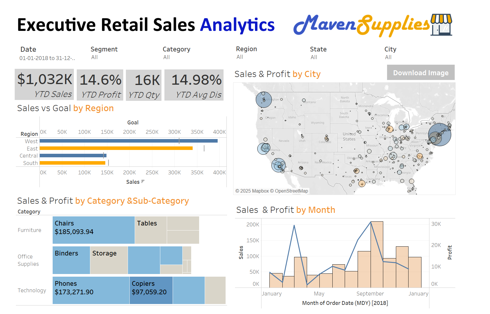

# Executive Retail Sales Analytics

&nbsp;

## Overview

This repository contains a Tableau dashboard that provides insights into executive retail sales analytics. Tableau is a powerful tool for data visualization and storytelling, helping businesses uncover trends and make data-driven decisions. This project demonstrates how Tableau can be used to tell a compelling story through sales data.
This repository contains a Tableau dashboard that provides insights into executive retail sales analytics. The dashboard includes key performance metrics such as Year-to-Date (YTD) sales, profit, quantity, and average discount. It also visualizes sales and profit distribution across various dimensions, including region, category, city, and time.

## Dataset

The analysis in this project is based on the Maven Supplies Raw dataset. The dataset includes sales, orders, and returns data, which were used to generate insights.

## Tool used :
&nbsp;

## Key Insights

### Storytelling with Tableau

This dashboard highlights key business insights through data storytelling. The following stories emerge from the analysis:

1.New York City is the best performer across all key metrics.

2.September 2018 marked the highest sales and profit in the dataset.

3.Central & West regions performed the best in terms of sales and profitability.

These insights help businesses identify high-performing areas and make strategic decisions based on real data.

### 1. Sales & Profit Overview

•	Total YTD Sales: $1.747K (An increase of 8% compared to the previous year)

• YTD Profit Margin: 13.50% (Slightly below the industry benchmark of 15%)

•	Total Quantity Sold: 28K (Consistent with last year's performance)

•	YTD Average Discount: 15.35% (Higher than the recommended 12%, potentially impacting profit margins)

•	Total YTD Sales: $1.747K

•	YTD Profit Margin: 13.50%

•	Total Quantity Sold: 28K

•	YTD Average Discount: 15.35%

### 2. Top Insights from the Analysis

•	New York City is the best performer across all key metrics.

•	September 2018 marked the highest sales and profit in the dataset.

•	Central & West regions performed the best in terms of sales and profitability.

### 3. Sales vs Goal by Region

•	The West region has the highest sales, surpassing the set goal.

•	The East region follows with substantial sales but does not meet the goal.

•	Central and South regions have lower sales compared to the West and East.

### 4. Sales & Profit by Category & Sub-Category

•	Tree Map Visualization Used to display the sales and profit distribution.

•	Furniture: Chairs and Tables contribute significantly to sales, with Chairs leading.

•	Office Supplies: Storage and Binders dominate this category.

•	Technology: Phones generate the highest sales, followed by Copiers and Accessories.

### 5. Sales & Profit by City

•	Map with Bubble Visualization Used to represent performance across different cities.

•	Larger blue circles indicate higher sales and profit, while orange circles indicate lower profit margins.

### 6. Sales & Profit by Months

•	Line Chart Visualization Used to depict monthly trends.

•	There are visible sales spikes in December 2017 and December 2018, indicating possible seasonal trends.

•	Profit trends fluctuate with sales but do not always correlate perfectly.

## Data Processing

•	A Left Join was performed on Orders and Orders Add-On tables with the Returns table.

•	The data was filtered to include only the years 2017 and 2018.

•	A Quick Filter was implemented to allow users to view data for a single year.

•	Created a custom measure: SUM([Sales])/SUM([Fixed_State]) for enhanced analysis.

## Usage

•	This Tableau dashboard helps businesses analyze sales trends and profitability.

•	The insights can guide strategic decisions such as regional investments, discount policies, and category prioritization.

## Dashboard :
&nbsp;

## Story Telling :

&nbsp;
